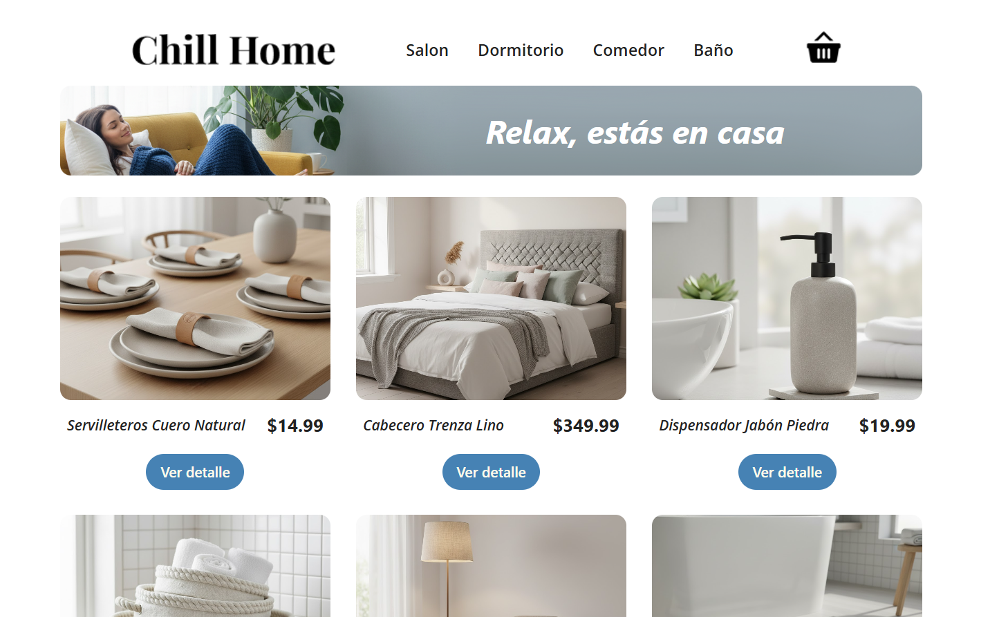

<h1 align="center">

  <br>
  Chill Home
  <br>
</h1>

<h4 align="center">🏠  Tienda de Decoración Ficticia</h4>

<p align="center">
 E-commerce de productos de decoración para el hogar.  <br> Este proyecto se enfoca en demostrar el manejo de estado, el enrutamiento y la interacción con una base de datos en tiempo real. <br>
 Proyecto final - Bootcamp de React en Coderhouse. 
</p>




## 🛠️ Tecnologias 

| Categoría | Tecnología | Uso y Rol |
| :--- | :--- | :--- |
| **Lenguaje** | **JavaScript (ES6+)** | Lenguaje de programación principal. |
| **Framework Base** | **React.js** | Biblioteca principal para construir la interfaz de usuario. |
| **Tooling** | **Vite** | Empaquetador y entorno de desarrollo rápido. |
| **Estilado** | **Tailwind CSS** | Framework *utility-first* para un diseño rápido y responsive. |
| **Backend / DB** | **Firebase** | Base de datos **Firestore** para almacenar el catálogo de productos y las órdenes de compra. |
| **Enrutamiento** | **React Router** | Manejo de las rutas y navegación entre vistas (`/`, `/detail/:id`, `/cart`). |
| **Gestión de Estado** | **React Context API** | Utilizado para la gestión global del carrito de compras y el estado de la aplicación. |
| **Notificaciones** | **PrimeReact Toast** | Componente para mostrar notificaciones de éxito y error al usuario (ej: "Producto agregado al carrito"). |


## 🚀 Cómo Ejecutar el Proyecto
Sigue estos pasos para tener una copia local del proyecto en funcionamiento:
```bash
# 1
$ git clone https://github.com/maria-lo-alc/chill-home.git

# 2
$ cd chill-home

# 3
$ npm install

# 4
$ npm run dev
```


